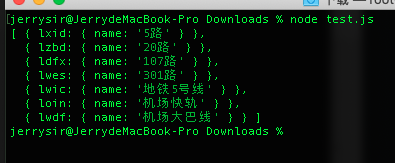

# amap_test
记录一次高德面试题

请在你熟悉的编辑器或IDE里写好代码后用屏幕截图工具截取并提交(注意：不接受手机拍照)
/*
* 实现函数parse，将服务端返回的公交数据按下面定义的规则优先级输出：
*
* 1. 输出常规线路，并按照线路数字从小到大排列(如20路，301路等这些都是常规路线)
* 2. 输出地铁线路，并按照线路数字从小到大排序
* 3. 输出其它线路，并按照线路名称长短从小到大排序
*
* parse的函数签名是:
* declare function parse(res: Object): Object;
*
* 下面代码为示例数据按照上述规则和函数签名转换后结果，请参照该示例数据实现对应效果
*/
const res = {
code: 0,
data: {
lines: '20路,301路,5路,地铁5号线,机场大巴线,107路,机场快轨',
lineids: 'lzbd,lwes,lxid,lwic,lwdf,ldfx,loin',
linedetails: {
lwdf: {
name: '机场大巴线'
},
lwes: {
name: '301路'
},
lwic: {
name: '地铁5号线'
},
ldfx: {
name: '107路'
},
lzbd: {
name: '20路'
},
lxid: {
name: '5路'
},
loin: {
name: '机场快轨'
}
}
}
}
const data = parse(res)
// data经过parse函数转化后，变成以下结构
/*
[{
lxid: {
name: '5路'
}
}, {
lzbd: {
name: '20路'
}
}, {
ldfx: {
name: '107路'
}
}, {
lwes: {
name: '301路'
}
}, {
lwic: {
name: '地铁5号线'
}
}, {
loin: {
name: '机场快轨'
}
}, {
lwdf: {
name: '机场大巴线'
}
}]
*/


以下是源码：
``` JavaScript
const res = {
    code: 0,
    data: {
        lines: '20路,301路,5路,地铁5号线,机场大巴线,107路,机场快轨',
        lineids: 'lzbd,lwes,lxid,lwic,lwdf,ldfx,loin',
        linedetails: {
            lwdf: {
                name: '机场大巴线'
            },
            lwes: {
                name: '301路'
            },
            lwic: {
                name: '地铁5号线'
            },
            ldfx: {
                name: '107路'
            },
            lzbd: {
                name: '20路'
            },
            lxid: {
                name: '5路'
            },
            loin: {
                name: '机场快轨'
            }
        }
    }
}

function parse(res) {
    if (res.code == 0) {
        let _allData = [];
        for(let i in res.data.linedetails){
            _allData.push({[i] : res.data.linedetails[i]});
        }

        let _busList = sortBus(filtBus(_allData));
        let _subwayList = sortSubway(filtSubway(_allData));
        let _otherList = sortOther(filtOther(_allData));

        return _busList.concat(_subwayList).concat(_otherList);
    } else {
        return [];
    }
}

function filtBus(val) {
    return val.filter((item) => { return Object.values(item)[0].name.search('路') > 0 });
}

function sortBus(val) {
    var arr = val;
    for(var j=0;j<arr.length-1;j++){
           for(var i=0;i<arr.length-1-j;i++){
               let currentS = Object.values(arr[i])[0].name;
               let currentNum = currentS.slice(0, currentS.search('路'))
               let nextS = Object.values(arr[i+1])[0].name;
               let nextNum = nextS.slice(0, nextS.search('路'))
                if(+currentNum>+nextNum){
                    var temp = arr[i];
                    arr[i] = arr[i+1];
                    arr[i+1] = temp;
                }
            } 
        }
        return arr;
}

function filtSubway(val) {
    return val.filter((item) => { return Object.values(item)[0].name.search('地铁') == 0 });
}

function sortSubway(val) {
    var arr = val;
    for(var j=0;j<arr.length-1;j++){
           for(var i=0;i<arr.length-1-j;i++){
               let currentS = Object.values(arr[i])[0].name;
               let currentNum = currentS.slice(currentS.search('地铁'), currentS.search('号线'))
               let nextS = Object.values(arr[i+1])[0].name;
               let nextNum = nextS.slice(nextS.search('地铁'), nextS.search('号线'))
                if(+currentNum>+nextNum){
                    var temp = arr[i];
                    arr[i] = arr[i+1];
                    arr[i+1] = temp;
                }
            } 
        }
        return arr;
}

function filtOther(val) {
    return val.filter((item) => { return Object.values(item)[0].name.search('路') == -1 && Object.values(item)[0].name.search('地铁') == -1 });
}

function sortOther(val) {
    var arr = val;
    for(var j=0;j<arr.length-1;j++){
           for(var i=0;i<arr.length-1-j;i++){
               let currentS = Object.values(arr[i])[0].name;
               let nextS = Object.values(arr[i+1])[0].name;
                if(currentS.length>+nextS.length){
                    var temp = arr[i];
                    arr[i] = arr[i+1];
                    arr[i+1] = temp;
                }
            } 
        }
        return arr;
}

console.log(parse(res));
```


